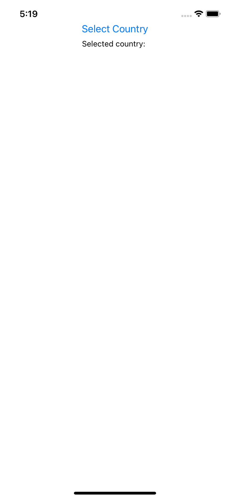
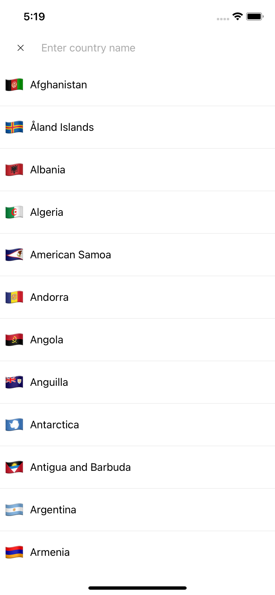
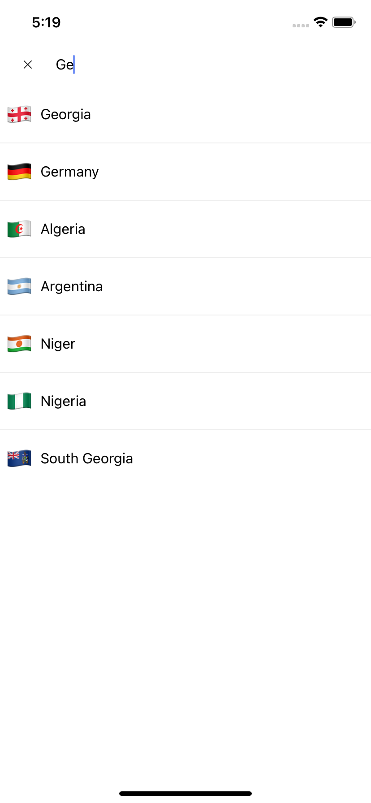
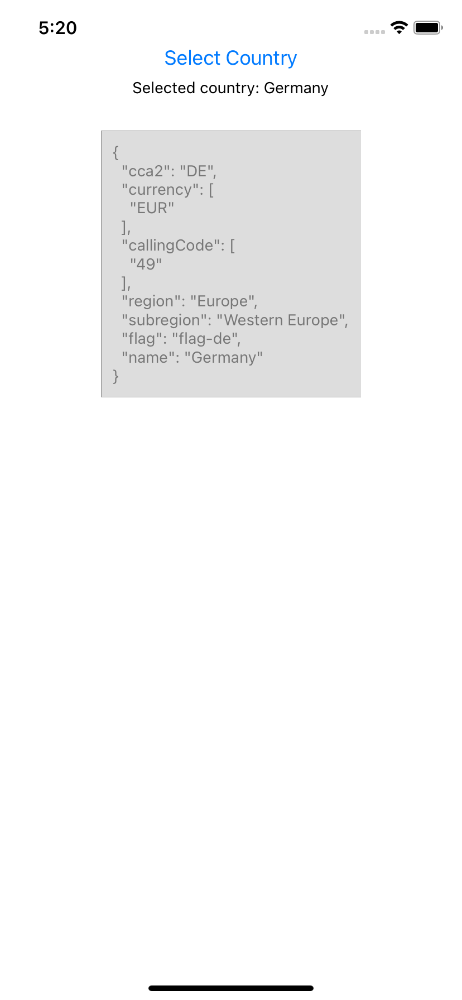

## React Native Modal Country Picker Example (with Expo)

`$ git clone https://github.com/Kaybarax/react-native-country-picker-example.git`

`$ yarn install`

`$ yarn start`

### Screenshots

 

